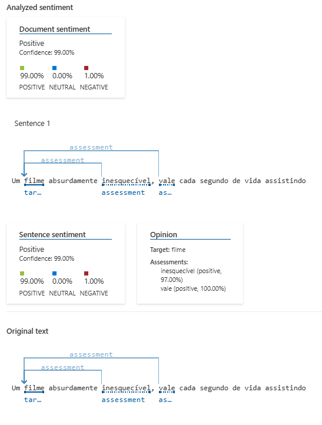
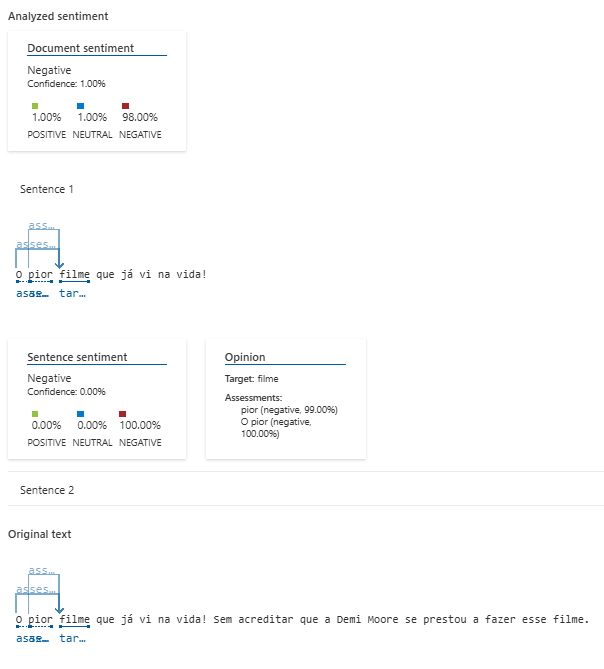
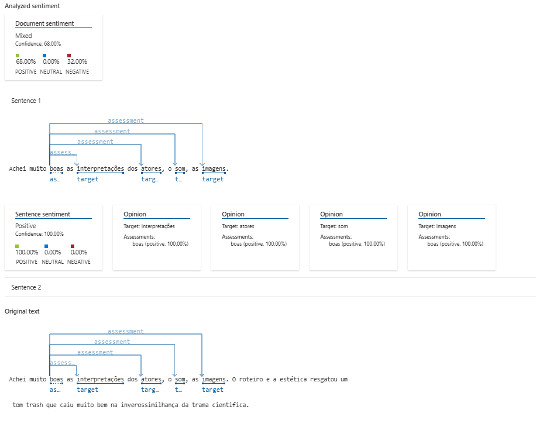
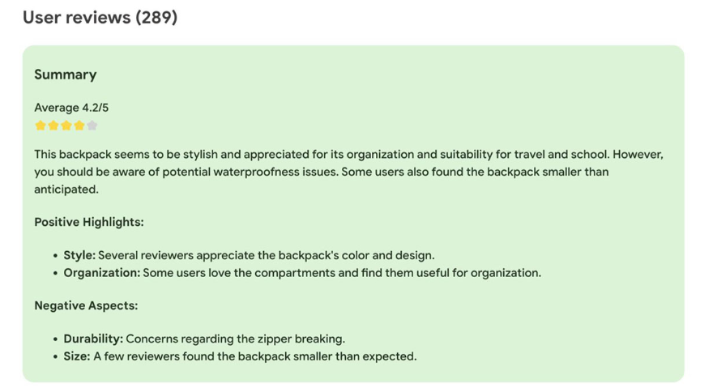

# Análise de Sentenças com IA - DIO

Projeto de análise de sentenças utilizando o Language Studio da Azure.

## Sobre o Projeto

Este projeto foi desenvolvido como parte do desafio da DIO, com o objetivo de explorar conceitos de análise de linguagem natural (NLP), utilizando ferramentas como Speech Studio e Language Studio.

O foco principal foi realizar a análise de sentimentos de algumas frases e refletir sobre os resultados obtidos.

---

## Como Funciona

1. Criei uma pasta chamada `inputs` com algumas sentenças variadas.
2. Utilize o Language Studio da Azure para realizar a análise dessas frases.
3. Capturei os resultados em imagens e trouxe aqui para ilustrar.

---

## Prints da Análise

Escolhi 3 críticas ao filme *"A Substância"*. Cada uma com uma nota diferente:

- Frase 1: Avaliação de 5 estrelas.
- Frase 2: Avaliação de 1 estrela.
- Frase 3: Avaliação de 3 estrelas.

### Análise da Frase 1

### Análise da Frase 2

### Análise da Frase 3

---

## Insights Obtidos

A partir dos resultados, foi possível perceber que a IA consegue classificar comentários e avaliações de usuários com bastante eficiência.

- Frases positivas e negativas foram facilmente identificadas.
- A neutralidade das frases também foi bem percebida.
- Algumas possíveis aplicações dessa tecnologia:
  - Monitoramento de redes sociais
  - Análise de feedback de clientes
  - Ferramentas de atendimento automatizado
  - Classificação automática de sentimentos em pesquisas e reviews

---

## Exemplos de Uso Com outras IAs

Grandes empresas de tecnologia, Amazon, e ferramentas disponíveis em extensões do Google Chrome já utilizam outros serviços de IAs de análise de sentimentos para resumir a opinião geral dos usuários sobre um produto ou serviço.

---
